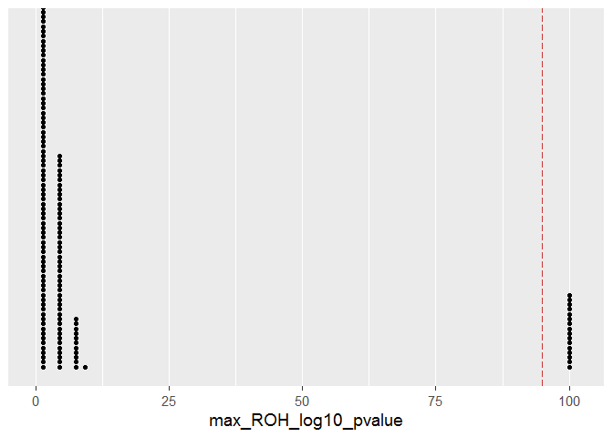
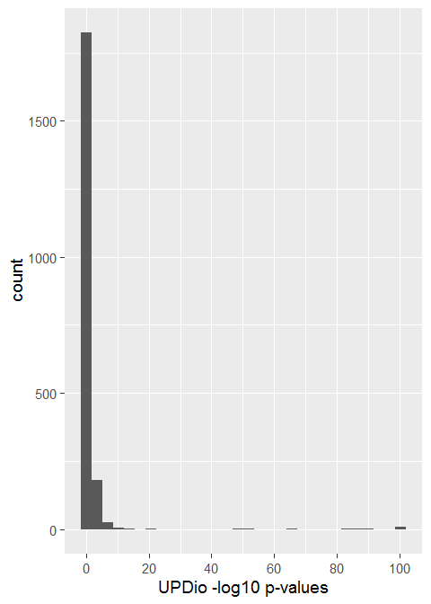
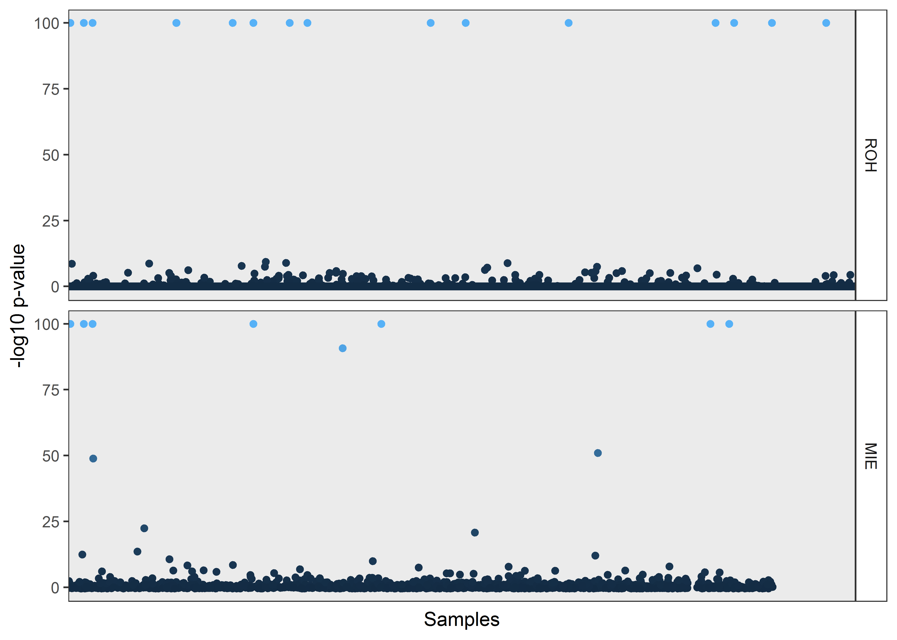
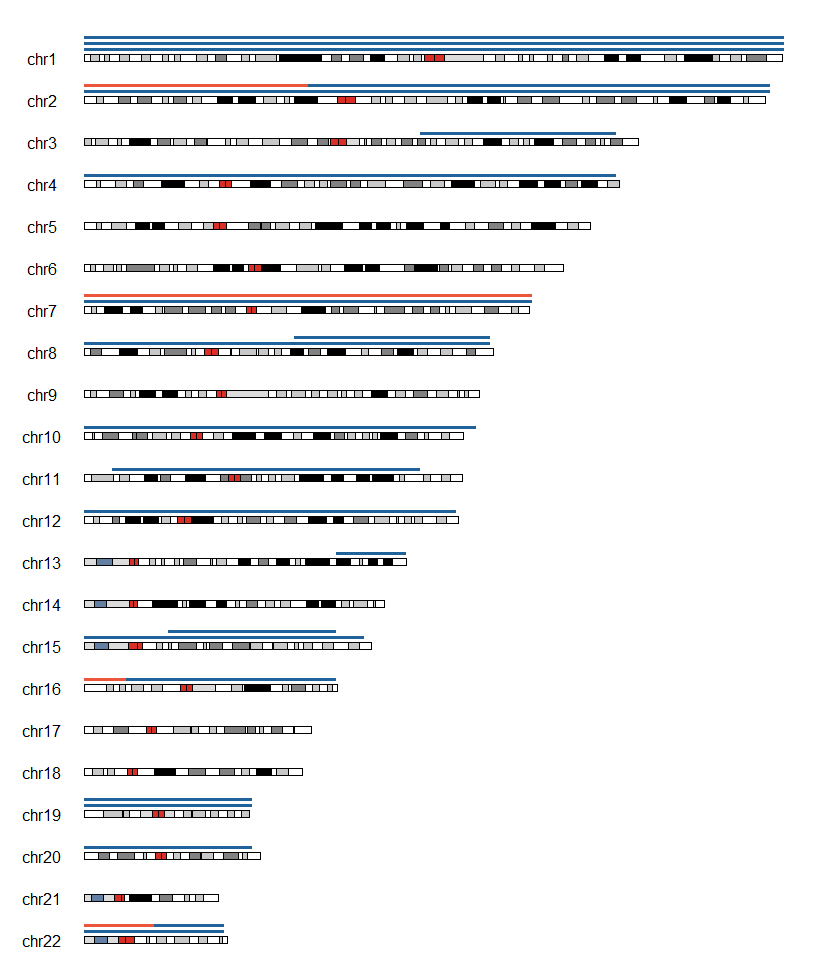

UPDive
================
Kevin Yauy, MD (Radboudumc, CHU de Montpellier)

  - [Library](#library)
  - [Single case Exome Sequencing
    Analysis](#single-case-exome-sequencing-analysis)
      - [Data processing](#data-processing)
      - [Dataframe processing](#dataframe-processing)
      - [Data visualization](#data-visualization)
  - [Trio Exome Sequencing Analysis](#trio-exome-sequencing-analysis)
      - [Requirements](#requirements)
      - [Data processing](#data-processing-1)
      - [Dataframe processing](#dataframe-processing-1)
      - [Data visualization](#data-visualization-1)
  - [UPDive results](#updive-results)
      - [Dataframe processing](#dataframe-processing-2)
      - [Data visualization](#data-visualization-2)
  - [UPDive for other pipelines](#updive-for-other-pipelines)
      - [Single ES](#single-es)
      - [Trio ES](#trio-es)

**UniParental Disomy Identification methods Validated for Exome
sequencing with 27923 samples.**

This is the code repository of the UPDive study to validate a UPD
detection method adapted for Exome Sequencing.

If you want to cite us, please use :

> Yauy K., de Leeuw N., Gilissen C. and Pfundt R., UPDive : Uniparental
> disomy identification pipeline validated for exome sequencing with
> 27923 samples. (2019)

Date of publication : 2019-04-15

## Library

Analysis have been realized with R 3.5.1, H3M2 (v.2013-12-19) and UPDio
V1.0.

``` r
# Data processing
library(quantable)
library(data.table)
library(dplyr)
library(reshape2)

# Data visualization
library(ggplot2)
library(cowplot)
library(ggpubr)
library(karyoploteR)
```

## Single case Exome Sequencing Analysis

Uniparental isodisomy could be detected by long stretch of homozygosity.
Here we present code for our method using H3M2 bed output and median
absolute deviation.

### Data processing

#### ROH Output from H3M2

Command line to format the bed output from H3M2 into UPD analysis call.

It will calculate the sum of ROH size by chromosome and output a clean
format for each sample.

``` bash
for i in /ifs/data/research/projects/kevin/UPD/ROH_raw_all/*.bed ;

do printf "Sample\n$(basename "$i" | cut -d. -f1)" > /ifs/data/research/projects/kevin/UPD/ROH_all_processed/$(basename "$i" | cut -d. -f1).sample.bed ; awk -F "\t" '{l[$1]+=($3-$2)} END {for (i in l) {print i,l[i]}}' "$i" | sort -k1,1V | sed 's/ /\t/g' | awk '{for (f=1;f<=NF;f++) col[f] = col[f]":"$f} END {for (f=1;f<=NF;f++) print col[f]}' | tr ':' '\t' | paste /ifs/data/research/projects/kevin/UPD/ROH_all_processed/$(basename "$i" | cut -d. -f1).sample.bed - > /ifs/data/research/projects/kevin/UPD/ROH_all_processed/$(basename "$i" | cut -d. -f1).processed.bed ; 

rm -f /ifs/data/research/projects/kevin/UPD/ROH_all_processed/$(basename "$i" | cut -d. -f1).sample.bed ; 
done
```

Command line to merge all file into one file that will be use for UPD
calls, header included.

``` bash
head -n1 /ifs/data/research/projects/kevin/UPD/ROH_all_processed/********.processed.bed >  /ifs/data/research/projects/kevin/UPD/ROH_all_processed/allROH_processed.tsv
find . -name "*.bed" | xargs -n 1 tail -n +2 >> allROH_processed.tsv
```

### Dataframe processing

#### ROH data from H3M2

Loading data

``` r
df <- read.delim("~/UPD/R/allROH_processed.tsv",row.names =1)
df$X <- NULL
df$chrX <- NULL
```

Use robustscale function to apply MAD

``` r
df.MAD <- robustscale(df, dim = 2, center=TRUE, scale = TRUE, preserveScale = FALSE)
df.final <- df.MAD$data
```

Create consanguinity filter

``` r
df.final$high_ROH_number <- rowSums(df.final > 3, na.rm = TRUE)
df.final$consanguinity <- FALSE
df.final$consanguinity[df.final$high_ROH_number >= 3] <- TRUE
df.final.filter <- df.final[df.final$consanguinity == FALSE,]
df.final.filter <- df.final.filter[,c(1:22)]
```

Log transformation for normal distribution assumption testvia data
visualization.

``` r
df.nlog.plot <- log(df.final.filter - min(df.final.filter, na.rm=TRUE) + 1)
df.nlog.plot <- scale(df.nlog.plot)
df.nlog.plot <- as.data.frame(df.nlog.plot)
```

With assumption of log-normal transformation, we did MAD to p-value
transformation and Bonferroni correction (n= 22 chromosomes \* 29723 ES
samples = 653906). Minimum p-value are set to 1e-100.

``` r
df.nlog <- log(df.final.filter - min(df.final.filter, na.rm=TRUE) + 1)
df.nlog <- scale(df.nlog)
df.nlog <- apply(df.nlog, 2, function(x) 1-pnorm(x))
df.nlog <- pmin(apply(df.nlog, 2, function(x) x * 653906),1)
df.nlog <- pmax(df.nlog, 1e-100)

df.nlog <- as.data.frame(df.nlog)
```

\-Log10 transformation for data visualization.

``` r
df.nlog$max_ROH_pvalue <- apply(df.nlog[,0:22], 1, function (x) min(x, na.rm = TRUE))
df.nlog$max_ROH_log10_pvalue <- -log10(df.nlog$max_ROH_pvalue)
df.nlog <- as.data.frame(df.nlog)
df.nlog10.plot <- -log10(df.nlog[,c(1:22)])
```

### Data visualization

#### ROH

##### Median absolute deviation

Here are the median absolute deviation for each chromosome that we use
to scale and compare the total ROH size between samples.

    ##         value
    ## chr1  5392826
    ## chr2  6417815
    ## chr3  6120910
    ## chr4  6122054
    ## chr5  5181447
    ## chr6  5143813
    ## chr7  4279464
    ## chr8  4581654
    ## chr9  4079617
    ## chr10 3487247
    ## chr11 3874609
    ## chr12 3834250
    ## chr13 6980662
    ## chr14 4286490
    ## chr15 2498234
    ## chr16 3174542
    ## chr17 2312364
    ## chr18 4108129
    ## chr19 1505326
    ## chr20 2162825
    ## chr21 1758725
    ## chr22 1261463

##### Normal distribution validation

log(MAD) distribution with normal distribution curve plotted

``` r
my_plots_pubmad.3nlog <- lapply(names(df.nlog.plot), function(var_x){
  
  me = mean(df.nlog.plot[[var_x]],na.rm=TRUE)
  s = sd(df.nlog.plot[[var_x]], na.rm=TRUE)
  binwidth = 0.1
  n = 29723
  p <- 
    ggplot(df.nlog.plot, aes(mean = me, sd = s, binwidth = binwidth, n = n)) + aes_string(var_x)
  
  if(is.numeric(df.nlog.plot[[var_x]])) {
    p <- p + geom_histogram(binwidth = binwidth,color="darkblue", fill="lightblue") + stat_function(fun = function(var_x) dnorm(var_x, mean = me, sd = s) * n * binwidth, color = "darkred", size = 1) + theme_gray(base_size = 14) 
  } else {
    p <- p + geom_bar(color="darkblue", fill="lightblue") + stat_function(fun = function(var_x) dnorm(var_x, mean = me, sd = s) * n  * binwidth, color = "darkred", size = 1)
  } 
  
})

plot_grid(plotlist = my_plots_pubmad.3nlog)
```

<!-- -->

log(MAD) qqplot

``` r
my_plots_madqq <- lapply(names(df.nlog.plot), function(var_x){
  p <- 
    ggplot(df.nlog.plot, aes(sample = df.nlog.plot[[var_x]]))
  
  if(is.numeric(df.nlog.plot[[var_x]])) {
    p <- p + stat_qq() + stat_qq_line() + theme_gray(base_size = 14)
  } else {
    p <- p + stat_qq() + stat_qq_line()
  } 
  
})
plot_grid(plotlist = my_plots_madqq)
```

<!-- -->

##### MAD ROH p-value results

p-value dotplot plot

``` r
ggplot(df.nlog, aes(x=max_ROH_log10_pvalue)) + theme_gray(base_size = 14)  + geom_dotplot(dotsize=0.3, binwidth = 3)  + geom_vline(xintercept = 95, colour="brown3", linetype = "longdash") + scale_y_continuous(name = NULL, breaks = NULL)
```

<!-- -->

p-value dotplot plot by chromosome

``` r
my_plots_mad <- lapply(names(df.nlog10.plot), function(var_x){
  p <- 
    ggplot(df.nlog10.plot) +
    aes_string(var_x) +
    xlim(-1, 100) 
  
  if(is.numeric(df.nlog10.plot[[var_x]])) {
    p <- p + geom_dotplot(dotsize = 1.5)   + theme_gray(base_size = 14) + theme(legend.justification=c(1,0), legend.position=c(1,0)) + geom_vline(xintercept = 95, colour="brown3", linetype = "longdash") + scale_y_continuous(name = NULL, breaks = NULL)
  } else {
    p <- p + geom_bar()
  } 
  
})
plot_grid(plotlist = my_plots_mad)
```

<!-- -->

## Trio Exome Sequencing Analysis

Both uniparental isodisomy and heterodisomy could be reported with trio
analysis based on Mendelian inheritance errors. We validate this
approach with [UPDio](https://github.com/findingdan/UPDio).

### Requirements

``` r
#R Dependencies
#    library(quantsmooth), optional
# Perl Dependencies
#    Statistics::R (0.31)
#    Path::Class
#    Vcf
#    Iterator::Simple
#    List::MoreUtils
#    Math::Round
#    Const::Fast
```

To be noticed : A file is missing to create plot. You can copy it from
previous versions.

``` bash
git clone https://github.com/findingdan/UPDio
cp ~/UPDio/version_0.9/scripts/plot_zygosity_and_events.R ~/UPDio/version_1.0/scripts/
```

### Data processing

#### CNV file

We use CNV file produce by Conifer. We just create a simple 3-column bed
file with CNV calls for each sample.

``` bash
for i in /ifs/data/research/projects/kevin/UPD/CNV/*calls.txt ; do tail -n+2 $i | cut -f2,3,4 > /ifs/data/research/projects/kevin/UPD/CNV/$(basename $i | cut -d_ -f1).cnv.txt ; done
```

#### UPDio calls

We needed to pre-processed vcf file from Haplotype caller to be ready
for UPDio.

``` bash

for i in /ifs/data/research/projects/kevin/UPD/VCF/*.vcf; do cat $i | perl -I "/ifs/home/kevin/perl5/lib/perl5/" /ifs/home/kevin/UPDio/version_1.0/scripts/sort-vcf | bgzip > /ifs/data/research/projects/kevin/UPD/VCF_UPDio/$(basename "$i" | cut -d_ -f1).sorted.vcf.gz ; perl -I "/ifs/home/kevin/perl5/lib/perl5/"  /ifs/home/kevin/UPDio/version_1.0/scripts/add_hom_refs_to_vcf.pl --polymorphic_sites  /ifs/home/kevin/UPDio/version_1.0/sample_data/common_variants_within_well_covered_target_regions.txt --no_homREF_vcf /ifs/data/research/projects/kevin/UPD/VCF_UPDio/$(basename "$i" | cut -d_ -f1).sorted.vcf.gz | bgzip > /ifs/data/research/projects/kevin/UPD/VCF_UPDio/$(basename "$i" | cut -d_ -f1).sorted.homREFed.vcf.gz ; rm -f /ifs/data/research/projects/kevin/UPD/VCF_UPDio/$(basename "$i" | cut -d_ -f1).sorted.vcf.gz ; done
```

We launched then UPDio for all trio exome sequencing available among a
list (tabulated file with child, father and mother ID by line)

``` bash
#!/bin/bash

file=/ifs/data/research/projects/kevin/UPD/family_sorted_mendel.txt 
while read -r line ; do   
  echo line
  echo ${line}
  echo child
  child=$(echo "$line" | cut -f2) 
  echo ${child}
  echo dad
  dad=$(echo "$line" | cut -f3)
  echo ${dad}
  echo mom
  mom=$(echo "$line" | cut -f4)
  echo ${mom}
#  echo complete child
#  echo /ifs/data/research/projects/kevin/UPD/VCF_UPDio/$( echo $line | cut -f2 ).sorted.homREFed.vcf.gz
#  echo complete mom
#  echo /ifs/data/research/projects/kevin/UPD/VCF_UPDio/$( echo $line | cut -f4 ).sorted.homREFed.vcf.gz
perl -I "/ifs/home/kevin/perl5/lib/perl5/" /ifs/home/kevin/UPDio/version_1.0/UPDio.pl --child_vcf /ifs/data/research/projects/kevin/UPD/VCF_UPDio/${child}.sorted.homREFed.vcf.gz  --mom_vcf /ifs/data/research/projects/kevin/UPD/VCF_UPDio/${mom}.sorted.homREFed.vcf.gz --dad_vcf /ifs/data/research/projects/kevin/UPD/VCF_UPDio/${dad}.sorted.homREFed.vcf.gz --path_to_R /cm/shared/apps/bioinf/R/3.5.1/bin/R --R_scripts_dir /ifs/home/kevin/UPDio/version_1.0/scripts --output_path /ifs/data/research/projects/kevin/UPD/VCF_UPDio_processed_cnv --include_MI --common_cnv_file /ifs/home/kevin/UPDio/version_1.0/sample_data/common_dels_1percent.tsv --child_cnv_data /ifs/data/research/projects/kevin/UPD/CNV/${child}.cnv.txt  
done < $file
```

We gathered all UPD calls into one file.

``` bash
for i in /ifs/data/research/projects/kevin/UPD/VCF_UPDio_processed_cnv/*upd; do awk '{print FILENAME (NF?"\t":"") $0}' $i | sed 's/.sorted.homREFed.upd//g' >> /ifs/data/research/projects/kevin/UPD/VCF_UPDio_processed_cnv/complete_UPD_alltrio_cnv.tsv ; done
```

### Dataframe processing

Loading output data file, set bonferroni correction (n= 4912 trios) and
maximum -log10 p value to 100.

``` r
updio <- read.delim("~/UPD/R/complete_UPD_alltrio_cnv.tsv", header=FALSE)
updio$corr_pvalue <- 4912*(updio$V2)
updio$corr_log10_pvalue <- -log10(updio$corr_pvalue)
updio$corr_log10_pvalue <- pmin(updio$corr_log10_pvalue,100)
```

Create data table for plots

``` r
updio.log <- updio$corr_log10_pvalue
updio.log  <- as.data.frame(updio.log)
```

### Data visualization

We have the same distribution plot as previously reported.

``` r
#ggplot(updio.log, aes(x=updio.log)) + geom_dotplot(dotsize = 0.5) + theme_gray(base_size = 14)  + scale_x_continuous("UPDio -log10 p-values", breaks= c(0,20,40,60,80,100))

ggplot(updio.log, aes(x=updio.log)) + geom_histogram() + theme_gray(base_size = 14)  + scale_x_continuous("UPDio -log10 p-values", breaks= c(0,20,40,60,80,100))
```

<!-- -->

## UPDive results

### Dataframe processing

Get p-value for each analysis by sample. For UPDio, we keep only one
p-value by sample (the highest).

Merge results

``` r
updive.plot <- df.nlog.merge %>% full_join(updio.max.merge, by = "Sample")
colnames(updive.plot)[2] <- "ROH"
colnames(updive.plot)[3] <- "MIE"
updive.plot.melt <- melt(data=updive.plot,id="Sample")
```

### Data visualization

Common plot with normalized scale.

``` r
#tiff("techplot.tiff", width = 1200, height = 1200,type="cairo", compression="none",res=400)
#jpeg("techplot.jpg", width = 400, height = 400,type="windows", quality=100,res=125)

ggplot(updive.plot.melt, aes(x=Sample, y=value, color=value)) + 
  geom_point(na.rm = TRUE) +
  facet_grid(rows = vars(variable))  + 
  labs(x = "Samples", y = "-log10 p-value") +
  theme_bw()+
  theme(axis.text.x=element_blank(), axis.ticks.x=element_blank(),legend.position="none", panel.background = element_rect(fill="transparent"), strip.background = element_rect(fill="transparent") )
```

<!-- -->

``` r
#dev.off()
```

Karyotype plot

``` r
#tiff("karyoplot.tiff", width = 3440, height = 4000,type="cairo", compression="none",res=400)
#jpeg("karyoplot.jpg", width = 900, height = 1200,type="windows", quality=100,res=125)


# iupd complete #20639B optional #3CAEA3
# hupd complete #ED553B optional #F6D55C
kp <- plotKaryotype(chromosomes="autosomal", plot.type = 1)

#chr1
kpRect(kp, chr="chr1", x0=0, x1=250e6, y0=0, y1=0.1,col="#20639B",border=NA)
kpRect(kp, chr="chr1", x0=0, x1=250e6, y0=0.2, y1=0.3,col="#20639B",border=NA)
kpRect(kp, chr="chr1", x0=0, x1=250e6, y0=0.4, y1=0.5,col="#20639B",border=NA)

#chr2
kpRect(kp, chr="chr2", x0=0, x1=245e6, y0=0, y1=0.1,col="#20639B",border=NA)
kpRect(kp, chr="chr2", x0=80e6, x1=245e6, y0=0.2, y1=0.3 ,col="#ED553B",border=NA)

#chr3
kpRect(kp, chr="chr3", x0=120e6, x1=190e6, y0=0, y1=0.1,col="#ED553B",border=NA)

#chr4
kpRect(kp, chr="chr4", x0=0, x1=190e6, y0=0, y1=0.1,col="#20639B",border=NA)

#chr7
kpRect(kp, chr="chr7", x0=0, x1=160e6, y0=0, y1=0.1,col="#20639B",border=NA)
kpRect(kp, chr="chr7", x0=0, x1=160e6, y0=0.2, y1=0.3,col="#ED553B",border=NA)

#chr8
kpRect(kp, chr="chr8", x0=0, x1=145e6, y0=0, y1=0.1,col="#20639B",border=NA)
kpRect(kp, chr="chr8", x0=75e6, x1=145e6, y0=0.2, y1=0.3,col="#ED553B",border=NA)

#chr10
kpRect(kp, chr="chr10", x0=0, x1=140e6, y0=0, y1=0.1,col="#20639B",border=NA)

#chr11
kpRect(kp, chr="chr11", x0=10e6, x1=120e6, y0=0, y1=0.1,col="#20639B",border=NA)

#chr12
kpRect(kp, chr="chr12", x0=0, x1=133e6, y0=0, y1=0.1,col="#20639B",border=NA)

#chr13
kpRect(kp, chr="chr13", x0=90e6, x1=110e6, y0=0, y1=0.1,col="#ED553B",border=NA)

#chr15
kpRect(kp, chr="chr15", x0=0, x1=100e6, y0=0, y1=0.1,col="#20639B",border=NA)
kpRect(kp, chr="chr15", x0=30e6, x1=90e6, y0=0.2, y1=0.3,col="#20639B",border=NA)

#chr16
kpRect(kp, chr="chr16", x0=0, x1=15e6, y0=0, y1=0.1,col="#ED553B",border=NA)

#chr19
kpRect(kp, chr="chr19", x0=0, x1=60e6, y0=0, y1=0.1,col="#20639B",border=NA)
kpRect(kp, chr="chr19", x0=0, x1=60e6, y0=0.2, y1=0.3,col="#20639B",border=NA)

#chr20
kpRect(kp, chr="chr20", x0=0, x1=60e6, y0=0, y1=0.1,col="#20639B",border=NA)

#chr22
kpRect(kp, chr="chr22", x0=0, x1=50e6, y0=0, y1=0.1,col="#20639B",border=NA)
kpRect(kp, chr="chr22", x0=30e6, x1=50e6, y0=0.2, y1=0.3,col="#ED553B",border=NA)
```

<!-- -->

``` r
#kpAddBaseNumbers(kp, tick.dist = 10000000, tick.len = 10, tick.col="red", cex=0.5, minor.tick.dist = 1000000, minor.tick.len = 5, minor.tick.col = "gray")

#kpAddCytobandLabels(kp, force.all=TRUE, srt=90, col="orange", cex=0.3)

#dev.off()
```

## UPDive for other pipelines

### Single ES

For solo ES UPD calls, we recommend first to use
[H3M2](https://sourceforge.net/projects/h3m2/).

We created a simple script based on MAD of ROH size by chromosome we
reported on UPDive. The script will process H3M2 bed output to get total
ROH size by chromosome, substract MAD and scale sample ROH size by MAD
for each chromosome.

2 files will be produced :

  - <sample_name>\_UPDive\_table.txt with raw ROH size scale by MAD for
    each chromosome
  - <sample_name>\_UPDive\_report.txt with consanguinity filter and
    suspected iUPD founds

<!-- end list -->

``` bash
python H3M2_to_UPDive.py <H3M2 output bed file> <UPDive MAD ROH reference file>
This is the main function that will process H3M2 output bed file into a UPDive report.
- First argument has to be the H3M2 bed file.
- Second argument has to be the UPDive MAD ROH size by chromosome reference.

Output directory will be the same directory as H3M2 bed file.
```

### Trio ES

For trio ES UPD calls, we recommend to use UPDio v1.0 as we describe
earlier and in the [UPDio github](https://github.com/findingdan/UPDio).
